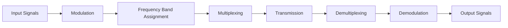
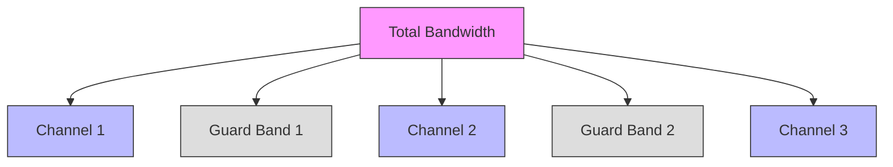
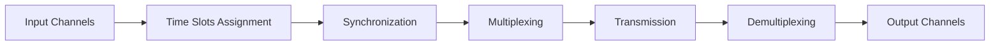
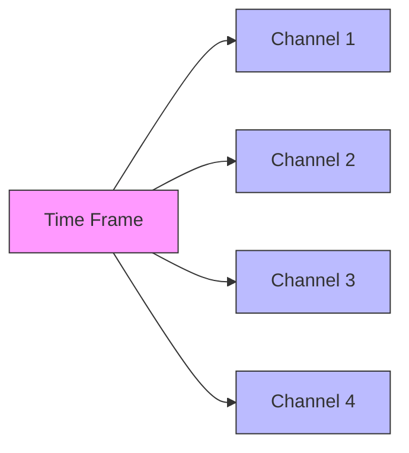
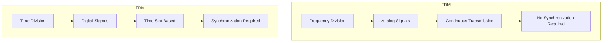

# Frequency Division Multiplexing (FDM) and Time Division Multiplexing (TDM)

## Frequency Division Multiplexing (FDM)

### Definition
FDM is an analog multiplexing technique that divides the available bandwidth of a communication channel into multiple non-overlapping frequency bands. Each data stream is assigned a unique frequency band, allowing multiple signals to be transmitted simultaneously over a single communication channel.

### Principle of Operation

1. **Bandwidth Division**: The total bandwidth of the transmission medium is divided into smaller, independent frequency bands or channels.
2. **Modulation**: Each input signal is modulated onto a unique carrier frequency within its assigned frequency band.
3. **Multiplexing**: The modulated signals are combined into a single composite signal using a multiplexer.
4. **Transmission**: The composite signal is transmitted over the shared communication channel.
5. **Demultiplexing**: At the receiver, a demultiplexer separates the composite signal into individual frequency bands.
6. **Demodulation**: Each separated signal is then demodulated to recover the original data.

### Frequency Band Allocation

### Key Concepts
- **Carrier Frequencies (Subcarriers)**: Specific frequencies used to modulate the input signals
- **Guard Bands**: Small frequency ranges between bands to prevent interference
- **Bandwidth Allocation**: Careful allocation based on signal requirements

### Advantages
- Efficient use of bandwidth
- Simple modulation and demodulation
- No synchronization required
- Well suited for analog signals

### Disadvantages
- Limited by available bandwidth
- Guard band overhead
- Intermodulation distortion
- Requires high bandwidth channel
- More susceptible to noise
- Requires many modulators
- Best for low speed channels

### Applications
- Radio and Television Broadcasting
- Telephone Systems
- Satellite Communication
- Cable Television

## Time Division Multiplexing (TDM)

### Definition
TDM is a digital multiplexing technique that divides the time domain into multiple time slots, allocating each slot to a different signal or channel.

### TDM Operation

### Time Slot Allocation

## Comparison between FDM and TDM

### Key Differences
- FDM divides frequency, TDM divides time
- FDM is analog, TDM is digital
- FDM requires guard bands, TDM requires synchronization
- FDM is continuous, TDM is discrete

### Related Technologies
- **Wavelength Division Multiplexing (WDM)**: A form of FDM used in optical fiber communication
- **Statistical Time Division Multiplexing (STDM)**: An advanced form of TDM that dynamically allocates time slots