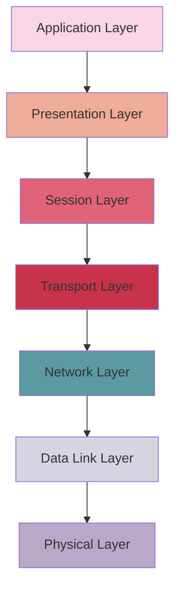
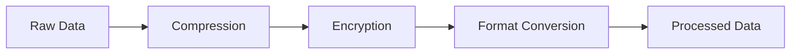
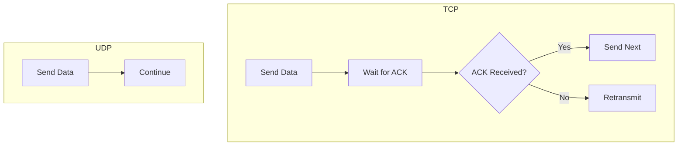
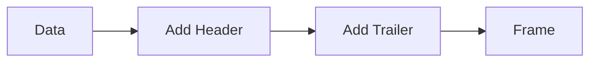
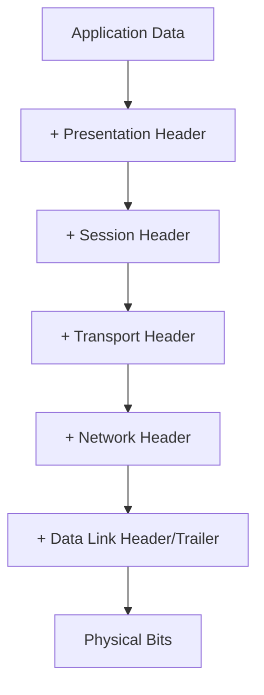

# OSI Model (Open Systems Interconnection Model)

The OSI Model is a conceptual framework that standardizes the functions of a telecommunication or computing system into seven abstraction layers.

## 1. Application Layer
This layer directly interacts with end-user applications.

### Key Functions:
- Provides application-level services
- Implements communication protocols
- Manages user interface and data formatting

### Common Protocols:
- HTTP/HTTPS (Web browsing)
- FTP (File transfer)
- SMTP (Email)
- DNS (Domain resolution)

## 2. Presentation Layer
Handles data formatting and encryption.

### Key Functions:
- Data translation and formatting
- Data compression
- Encryption/Decryption (SSL/TLS)
- Character code conversion

## 3. Session Layer
Manages sessions between applications.

### Key Functions:
- Session establishment and maintenance
- Authentication and authorization
- Session synchronization
- Dialog control

### Features:
- Uses APIs for inter-device communication
- Manages session tokens
- Handles session recovery

## 4. Transport Layer
Ensures reliable data delivery between applications.

### Key Functions:
- Segmentation of data
- Flow control
- Error control
- Port management

### Protocols:
1. TCP (Transmission Control Protocol)
   - Connection-oriented
   - Reliable delivery
   - Acknowledgment system
   
2. UDP (User Datagram Protocol)
   - Connectionless
   - Fast delivery
   - No acknowledgment

## 5. Network Layer
Handles logical addressing and routing.

### Key Functions:
- IP addressing
- Packet routing
- Path determination
- Subnet management

### Features:
- Uses IP addresses for unique identification
- Implements routing protocols
- Manages packet fragmentation

## 6. Data Link Layer
Provides reliable point-to-point delivery.

### Key Functions:
- Physical addressing (MAC)
- Frame formatting
- Error detection
- Flow control

### Components:
- Network Interface Card (NIC)
- MAC addressing
- Frame check sequence

## 7. Physical Layer
Handles the physical transmission of data.

### Key Functions:
- Bit-level transmission
- Physical topology
- Signal conversion
- Cable types and specifications

### Media Types:
- Copper cables
- Fiber optic
- Wireless signals

## Data Encapsulation

This model demonstrates how data is processed and transmitted through different layers of network communication, with each layer adding its own specific functionality to ensure reliable and secure data transfer.