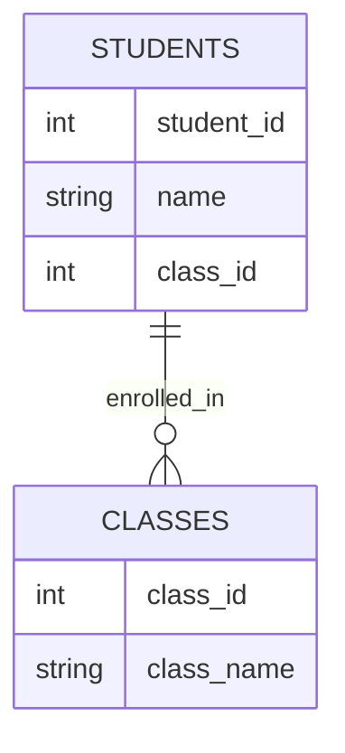
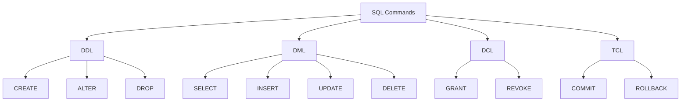

# UNIT-IV: MySQL Overview

## Database Fundamentals

### Definition
A database is an organized collection of structured information or data, typically stored electronically in a computer system and controlled by a Database Management System (DBMS).

### Key Points
- Structured data storage and retrieval system
- Eliminates data redundancy
- Ensures data integrity and consistency
- Supports multiple user access
- Provides data security and backup

### Example
Consider a library management system with normalized tables:

```sql
-- First Normal Form (1NF): Atomic values
CREATE TABLE books (
    book_id INT PRIMARY KEY,
    title VARCHAR(100),
    isbn VARCHAR(13) UNIQUE,
    publication_year INT,
    available BOOLEAN,
    category_id INT,
    publisher_id INT
);

-- Second Normal Form (2NF): No partial dependencies
CREATE TABLE authors (
    author_id INT PRIMARY KEY,
    first_name VARCHAR(50),
    last_name VARCHAR(50),
    birth_year INT
);

-- Junction table for many-to-many relationship
CREATE TABLE book_authors (
    book_id INT,
    author_id INT,
    PRIMARY KEY (book_id, author_id),
    FOREIGN KEY (book_id) REFERENCES books(book_id),
    FOREIGN KEY (author_id) REFERENCES authors(author_id)
);

-- Third Normal Form (3NF): No transitive dependencies
CREATE TABLE categories (
    category_id INT PRIMARY KEY,
    category_name VARCHAR(50),
    parent_category_id INT,
    FOREIGN KEY (parent_category_id) REFERENCES categories(category_id)
);

CREATE TABLE publishers (
    publisher_id INT PRIMARY KEY,
    publisher_name VARCHAR(100),
    country VARCHAR(50)
);
```

This example demonstrates:
- Table normalization (1NF, 2NF, 3NF)
- Primary and foreign key relationships
- Many-to-many relationships using junction tables
- Self-referencing relationships (category hierarchy)

### References
- [MySQL Official Documentation](https://dev.mysql.com/doc/)
- [W3Schools MySQL Tutorial](https://www.w3schools.com/mysql/)

### Fact
MySQL was originally developed for a personal database named after co-founder Michael Widenius's daughter My.

## Understanding RDBMS

### Definition
A Relational Database Management System (RDBMS) is software that manages relational databases, where data is organized in tables with relationships between them.

### Key Points
- Based on relational model
- Uses SQL for database operations
- Maintains data relationships
- Ensures ACID properties
- Provides backup and recovery

### Example
Relationship between tables in a school database:
```sql
CREATE TABLE students (
    student_id INT PRIMARY KEY,
    name VARCHAR(50),
    class_id INT,
    FOREIGN KEY (class_id) REFERENCES classes(class_id)
);
```



## Tables, Records & Fields

### Definition
Tables are the basic storage structure in a database, consisting of records (rows) and fields (columns).

### Key Points
- Tables organize data in rows and columns
- Each row represents a unique record
- Columns define data attributes
- Primary keys identify unique records
- Foreign keys establish relationships

### Example
Employee table structure:
```sql
CREATE TABLE employees (
    emp_id INT PRIMARY KEY,
    first_name VARCHAR(50),
    last_name VARCHAR(50),
    department VARCHAR(30),
    salary DECIMAL(10,2)
);
```

## SQL Language

### Definition
Structured Query Language (SQL) is a standardized language for managing and manipulating relational databases.

### Key Points
- DDL (Data Definition Language)
  - CREATE, ALTER, DROP, TRUNCATE
- DML (Data Manipulation Language)
  - SELECT, INSERT, UPDATE, DELETE
- DCL (Data Control Language)
  - GRANT, REVOKE
- TCL (Transaction Control Language)
  - COMMIT, ROLLBACK

### Example
Common SQL operations:
```sql
-- Creating a table
CREATE TABLE products (
    product_id INT PRIMARY KEY,
    name VARCHAR(100),
    price DECIMAL(10,2)
);

-- Inserting data
INSERT INTO products VALUES (1, 'Laptop', 999.99);

-- Querying data
SELECT * FROM products WHERE price > 500;

-- Updating data
UPDATE products SET price = 1099.99 WHERE product_id = 1;
```

### References
- [MySQL Workbench Tutorial](https://www.mysql.com/products/workbench/)
- [SQL Tutorial - Mode Analytics](https://mode.com/sql-tutorial/)

### Fact
SQL was originally developed at IBM in the 1970s and was initially called SEQUEL (Structured English Query Language).

