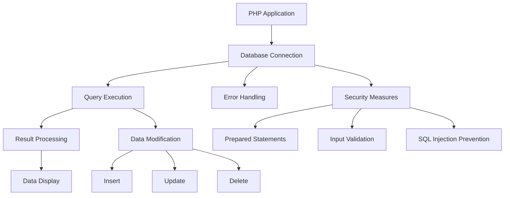

# MySQL Integration with PHP

## Introduction to PHP-MySQL Integration

### Definition

PHP-MySQL integration refers to the process of connecting PHP applications with MySQL databases to create dynamic, data-driven web applications.

### Key Points

- Seamless database connectivity through PHP's built-in functions
- Secure data handling and manipulation
- Support for complex database operations
- Real-time data processing capabilities
- Cross-platform compatibility
- Scalable application architecture

### Example

```php
// Basic PHP-MySQL connection
$host = "localhost";
$username = "your_username";
$password = "your_password";
$database = "your_database";

$connection = mysqli_connect($host, $username, $password, $database);

if (!$connection) {
    die("Connection failed: " . mysqli_connect_error());
}
echo "Connected successfully!";
```

## Database Connectivity

### Establishing Connection

```php
// Using MySQLi Object-Oriented approach
try {
    $mysqli = new mysqli($host, $username, $password, $database);
    if ($mysqli->connect_errno) {
        throw new Exception($mysqli->connect_error);
    }
} catch (Exception $e) {
    die("Connection failed: " . $e->getMessage());
}
```

### Connection Management

```php
// Connection Pool Implementation Example
class ConnectionPool {
    private static $instances = [];
    private static $maxConnections = 10;
    private $host;
    private $username;
    private $password;
    private $database;

    public function __construct($host, $username, $password, $database) {
        $this->host = $host;
        $this->username = $username;
        $this->password = $password;
        $this->database = $database;
    }

    public static function getInstance($host, $username, $password, $database) {
        $key = md5($host . $username . $database);
        if (!isset(self::$instances[$key]) || count(self::$instances[$key]) < self::$maxConnections) {
            self::$instances[$key][] = new mysqli($host, $username, $password, $database);
        }
        return self::$instances[$key][array_rand(self::$instances[$key])];
    }

    public static function closeAll() {
        foreach (self::$instances as $connections) {
            foreach ($connections as $connection) {
                $connection->close();
            }
        }
        self::$instances = [];
    }
}

// Enhanced Error Handling Example
class DatabaseConnection {
    private $connection;
    private $logger;

    public function __construct($host, $username, $password, $database) {
        try {
            $this->connection = new mysqli($host, $username, $password, $database);
            if ($this->connection->connect_errno) {
                $this->logError('Connection failed: ' . $this->connection->connect_error);
                throw new Exception($this->connection->connect_error);
            }
            $this->connection->set_charset('utf8mb4');
        } catch (Exception $e) {
            $this->logError('Connection error: ' . $e->getMessage());
            throw $e;
        }
    }

    private function logError($message) {
        error_log(date('Y-m-d H:i:s') . ' - ' . $message . "\n", 3, 'database_errors.log');
    }

    public function query($sql) {
        try {
            $result = $this->connection->query($sql);
            if (!$result) {
                $this->logError('Query failed: ' . $this->connection->error . ' SQL: ' . $sql);
                throw new Exception($this->connection->error);
            }
            return $result;
        } catch (Exception $e) {
            $this->logError('Query error: ' . $e->getMessage());
            throw $e;
        }
    }

    public function __destruct() {
        if ($this->connection) {
            $this->connection->close();
        }
    }
}
```

Key Features:
- Connection pooling for improved performance
- Comprehensive error handling and logging
- Automatic connection cleanup
- Character set configuration
- Query error tracking

## Database Querying

### Basic Query Execution

```php
// SELECT query example
$query = "SELECT * FROM users WHERE status = 'active'";
$result = $mysqli->query($query);

if ($result) {
    while ($row = $result->fetch_assoc()) {
        echo "Name: " . $row['name'] . "<br>";
    }
    $result->free();
}
```

### Prepared Statements

```php
// Secure way to handle user input
$stmt = $mysqli->prepare("INSERT INTO users (name, email) VALUES (?, ?)");
$stmt->bind_param("ss", $name, $email);

$name = "John Doe";
$email = "john@example.com";
$stmt->execute();
```

## Retrieving and Displaying Results

### Fetching Data

```php
// Different methods to fetch data
$result = $mysqli->query("SELECT * FROM products");

// Fetch as associative array
while ($row = $result->fetch_assoc()) {
    // Process data
}

// Fetch as object
while ($row = $result->fetch_object()) {
    // Process data
}
```

### Data Display Techniques

```php
// Display data in HTML table
$result = $mysqli->query("SELECT * FROM employees");
?>
<table border="1">
    <tr>
        <th>ID</th>
        <th>Name</th>
        <th>Position</th>
    </tr>
    <?php while ($row = $result->fetch_assoc()): ?>
    <tr>
        <td><?php echo htmlspecialchars($row['id']); ?></td>
        <td><?php echo htmlspecialchars($row['name']); ?></td>
        <td><?php echo htmlspecialchars($row['position']); ?></td>
    </tr>
    <?php endwhile; ?>
</table>
```

## Modifying Data

### Insert Operations

```php
// Basic INSERT query
$query = "INSERT INTO products (name, price) VALUES ('New Product', 29.99)";
$mysqli->query($query);

// Get last inserted ID
$last_id = $mysqli->insert_id;
```

### Update Operations

```php
// Basic UPDATE query
$query = "UPDATE users SET status = 'inactive' WHERE last_login < DATE_SUB(NOW(), INTERVAL 30 DAY)";
$mysqli->query($query);

// Get number of affected rows
$affected_rows = $mysqli->affected_rows;
```

## Deleting Data

### Delete Operations

```php
// Basic DELETE query
$query = "DELETE FROM orders WHERE status = 'cancelled'";
$mysqli->query($query);

// Safe deletion with limit
$query = "DELETE FROM logs WHERE timestamp < DATE_SUB(NOW(), INTERVAL 1 MONTH) LIMIT 1000";
$mysqli->query($query);
```

## Application Design

### Database Class Example

```php
class Database {
    private $connection;

    public function __construct($host, $username, $password, $database) {
        $this->connection = new mysqli($host, $username, $password, $database);
        if ($this->connection->connect_error) {
            throw new Exception("Connection failed: " . $this->connection->connect_error);
        }
    }

    public function query($sql) {
        return $this->connection->query($sql);
    }

    public function prepare($sql) {
        return $this->connection->prepare($sql);
    }

    public function close() {
        $this->connection->close();
    }
}
```

### Front-end Integration

```php
// Example of a simple CRUD interface
?>
<form method="POST" action="process.php">
    <input type="text" name="name" placeholder="Name" required>
    <input type="email" name="email" placeholder="Email" required>
    <button type="submit">Add User</button>
</form>

<?php
// Display users
$result = $db->query("SELECT * FROM users ORDER BY name");
while ($user = $result->fetch_assoc()) {
    echo "<div class='user-card'>";
    echo "<h3>{$user['name']}</h3>";
    echo "<p>{$user['email']}</p>";
    echo "<a href='edit.php?id={$user['id']}'>Edit</a>";
    echo "<a href='delete.php?id={$user['id']}'>Delete</a>";
    echo "</div>";
}
```

### References

- [PHP Manual: MySQL Functions](https://www.php.net/manual/en/book.mysqli.php)
- [W3Schools PHP MySQL Tutorial](https://www.w3schools.com/php/php_mysql_intro.asp)
- [MySQL Documentation](https://dev.mysql.com/doc/)

### Fact

PHP's MySQL integration capabilities have evolved significantly since PHP 5.0. The introduction of PDO (PHP Data Objects) and the improved MySQLi extension has made database operations more secure and efficient, replacing the older mysql\_\* functions which were deprecated in PHP 5.5 and removed in PHP 7.0.


