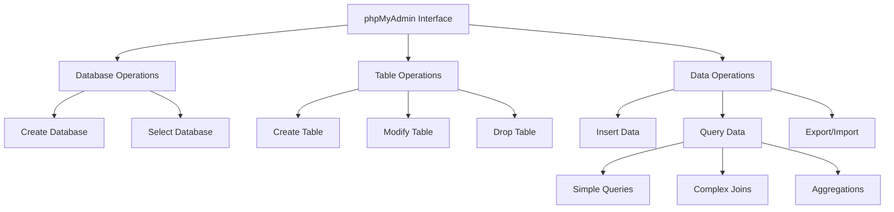

# Working with phpMyAdmin

## Introduction to phpMyAdmin

### Definition
phpMyAdmin is a free web-based tool for managing MySQL databases through a graphical user interface, making database administration tasks more accessible and visual.

### Key Points
- Web-based MySQL administration interface
- Supports multiple database operations
- User-friendly graphical interface
- Built-in SQL query editor
- Import/Export functionality
- Database backup and restore features

### Example
Accessing phpMyAdmin typically involves:
1. Starting your web server (Apache)
2. Opening browser and navigating to: `http://localhost/phpmyadmin`
3. Logging in with MySQL credentials

## Database Operations

### Creating a Database
```sql
-- Through SQL
CREATE DATABASE school_management;

-- Using phpMyAdmin GUI:
1. Click "New" in the left sidebar
2. Enter database name
3. Select collation (usually utf8mb4_general_ci)
4. Click "Create"
```

### Selecting a Database
```sql
-- Through SQL
USE school_management;

-- Using phpMyAdmin GUI:
1. Click on the database name in the left sidebar
2. The selected database will be highlighted
```

## Table Management

### Creating Tables
```sql
-- Creating a students table
CREATE TABLE students (
    student_id INT PRIMARY KEY AUTO_INCREMENT,
    first_name VARCHAR(50) NOT NULL,
    last_name VARCHAR(50) NOT NULL,
    email VARCHAR(100) UNIQUE,
    date_of_birth DATE,
    enrollment_date TIMESTAMP DEFAULT CURRENT_TIMESTAMP
);
```

### Dropping Tables
```sql
-- Through SQL
DROP TABLE IF EXISTS students;

-- Using phpMyAdmin GUI:
1. Select the table
2. Go to "Operations" tab
3. Click "Drop" in the "Remove table" section
```

## Data Operations

### Loading Data into Tables
```sql
-- Inserting single record
INSERT INTO students (first_name, last_name, email, date_of_birth)
VALUES ('John', 'Doe', 'john.doe@email.com', '2000-01-15');

-- Inserting multiple records
INSERT INTO students (first_name, last_name, email, date_of_birth) VALUES
('Jane', 'Smith', 'jane.smith@email.com', '2001-03-20'),
('Mike', 'Johnson', 'mike.j@email.com', '2000-11-30');
```

## Data Retrieval

### Selecting All Data
```sql
-- Retrieve all records
SELECT * FROM students;

-- Retrieve specific columns
SELECT first_name, last_name, email FROM students;
```

### Selecting Particular Rows
```sql
-- Using WHERE clause
SELECT * FROM students WHERE date_of_birth >= '2000-01-01';

-- Using multiple conditions
SELECT * FROM students 
WHERE date_of_birth >= '2000-01-01' 
AND last_name = 'Smith';
```

### Sorting Results
```sql
-- Ascending order
SELECT * FROM students ORDER BY last_name ASC;

-- Multiple sorting criteria
SELECT * FROM students 
ORDER BY last_name ASC, first_name DESC;
```

## Advanced Queries

### Working with Dates
```sql
-- Calculating age
SELECT 
    first_name,
    last_name,
    TIMESTAMPDIFF(YEAR, date_of_birth, CURDATE()) as age
FROM students;

-- Filtering by date ranges
SELECT * FROM students
WHERE date_of_birth BETWEEN '2000-01-01' AND '2005-12-31';
```

### Calculations
```sql
-- Using aggregate functions
SELECT 
    COUNT(*) as total_students,
    MIN(date_of_birth) as oldest_student,
    MAX(date_of_birth) as youngest_student
FROM students;
```

### Working with NULL Values
```sql
-- Finding NULL values
SELECT * FROM students WHERE email IS NULL;

-- Replacing NULL values
SELECT 
    first_name,
    COALESCE(email, 'No Email') as email_address
FROM students;
```

### Pattern Matching
```sql
-- Using LIKE operator
SELECT * FROM students 
WHERE email LIKE '%@email.com';

-- Using Regular Expressions
SELECT * FROM students 
WHERE first_name REGEXP '^[JM]';
```

### Multiple Table Operations

```sql
-- Creating a courses table
CREATE TABLE courses (
    course_id INT PRIMARY KEY AUTO_INCREMENT,
    course_name VARCHAR(100) NOT NULL,
    instructor VARCHAR(100)
);

-- Creating an enrollment table
CREATE TABLE enrollments (
    student_id INT,
    course_id INT,
    enrollment_date DATE,
    PRIMARY KEY (student_id, course_id),
    FOREIGN KEY (student_id) REFERENCES students(student_id),
    FOREIGN KEY (course_id) REFERENCES courses(course_id)
);

-- Joining multiple tables
SELECT 
    s.first_name,
    s.last_name,
    c.course_name,
    e.enrollment_date
FROM students s
JOIN enrollments e ON s.student_id = e.student_id
JOIN courses c ON e.course_id = c.course_id;
```

### Using Aliases
```sql
-- Table aliases
SELECT 
    s.first_name,
    s.last_name,
    c.course_name
FROM students AS s
JOIN enrollments AS e ON s.student_id = e.student_id
JOIN courses AS c ON e.course_id = c.course_id;

-- Column aliases
SELECT 
    CONCAT(first_name, ' ', last_name) AS full_name,
    email AS contact_email
FROM students;
```

## Security Best Practices

### User Management
```sql
-- Create user with limited privileges
CREATE USER 'app_user'@'localhost' IDENTIFIED BY 'strong_password';
GRANT SELECT, INSERT, UPDATE ON school_management.* TO 'app_user'@'localhost';

-- Remove anonymous users
DELETE FROM mysql.user WHERE User='';
FLUSH PRIVILEGES;
```

### Access Control
- Use SSL/TLS for remote connections
- Implement IP-based access restrictions
- Regularly audit user privileges
- Enable two-factor authentication when available

## Backup and Restore

### Database Backup
```sql
-- Using phpMyAdmin GUI:
1. Select database
2. Click 'Export'
3. Choose 'Custom' method
4. Select options:
   - 'Add CREATE DATABASE'
   - 'Add DROP TABLE'
   - 'Add dates'
5. Select compression (usually GZIP)

-- Using command line
MYSQLDUMP_PATH --user=username --password=password \
    --databases school_management \
    --add-drop-database \
    --events --routines \
    > backup_$(date +%Y%m%d).sql
```

### Database Restore
```sql
-- Using phpMyAdmin GUI:
1. Select database (or create new)
2. Click 'Import'
3. Choose backup file
4. Select appropriate options:
   - Character set
   - Format (usually SQL)
   - Enable foreign key checks

-- Using command line
mysql --user=username --password=password \
    school_management < backup_file.sql
```

### Backup Strategy
- Schedule regular automated backups
- Maintain multiple backup copies
- Test restore procedures regularly
- Document backup and restore procedures
- Monitor backup success/failure

### References
- [phpMyAdmin Documentation](https://www.phpmyadmin.net/docs/)
- [MySQL Documentation](https://dev.mysql.com/doc/)
- [W3Schools SQL Tutorial](https://www.w3schools.com/sql/)

### Fact
phpMyAdmin was created in 1998 by Tobias Ratschiller and was originally intended to handle the administration of a single MySQL database. Today, it is one of the most popular MySQL administration tools, supporting multiple databases and advanced features.

