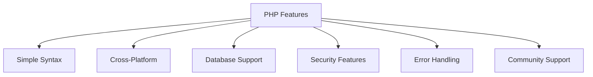
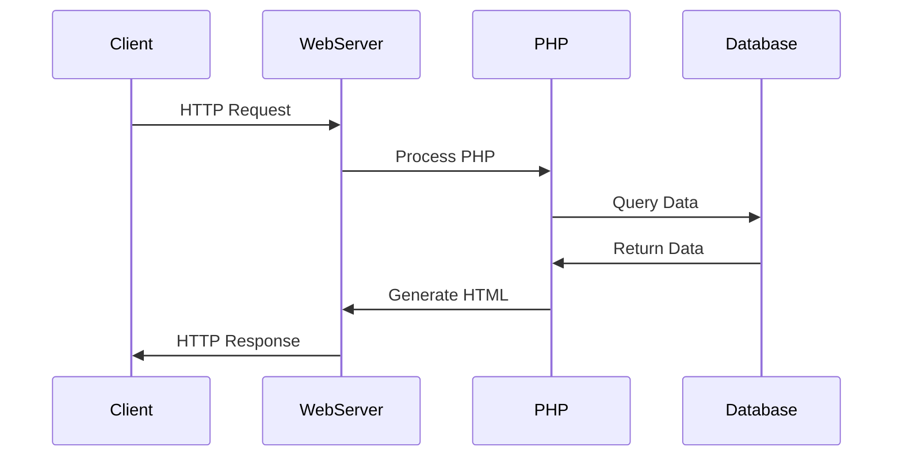

# UNIT-I: BASICS OF PHP

## Introduction to PHP
**Definition**: PHP (Hypertext Preprocessor) is a server-side scripting language designed specifically for web development.

### Key Points:
- Open-source scripting language
- Embedded directly into HTML
- Executes on the server side
- Generates dynamic web page content
- Supports multiple databases

### Example:
```php
<?php
  echo "Hello, World!";
?>
```

### References:
- [PHP Official Documentation](https://www.php.net/docs.php)
- [W3Schools PHP Tutorial](https://www.w3schools.com/php/)

### FACT:
PHP was originally created by Rasmus Lerdorf in 1994 and stood for "Personal Home Page".

## PHP Features

### Key Features:
1. Simple and Easy to Learn
2. Platform Independent
3. Database Support
4. Error Reporting
5. Security Features
6. Large Community Support



## Server-Client Environment

### Architecture Overview:


## XAMPP/WAMP Installation

### Components:
1. Apache Web Server
2. MySQL Database
3. PHP Interpreter
4. phpMyAdmin

### Installation Steps:
1. Download XAMPP/WAMP
2. Run installer
3. Choose components
4. Select installation directory
5. Start services


## Benefits of PHP-MySQL

### Advantages:
1. Free and Open Source
2. Cross-platform compatibility
3. Easy database integration
4. Large community support
5. Extensive documentation

## Web Server Configuration

### Important Files:
1. php.ini - PHP configuration
2. httpd.conf - Apache configuration
3. my.ini - MySQL configuration

### Key Settings:
- Document Root
- Port Numbers
- PHP Modules
- Error Reporting

## Exam Focus Points

### Practice Questions:
1. What is PHP and its primary use in web development?
   - PHP (Hypertext Preprocessor) is a server-side scripting language designed specifically for web development
   - Primary uses:
     * Creating dynamic web content
     * Database interaction and management
     * Session and cookie handling
     * Form processing and validation
     * Integration with HTML for web applications

2. Explain the client-server architecture.
   - Components:
     * Client (Web Browser): Sends requests and displays results
     * Web Server (Apache): Handles HTTP requests and responses
     * PHP Engine: Processes PHP code
     * Database Server: Stores and manages data
   - Process Flow:
     * Client sends HTTP request
     * Server processes request
     * PHP executes scripts
     * Database provides data
     * Server returns HTML response

3. List main components of XAMPP/WAMP.
   - Apache: Web server software
   - MySQL/MariaDB: Database management system
   - PHP: Server-side scripting language
   - phpMyAdmin: Database administration tool
   - Additional tools:
     * Mercury (Mail Server)
     * FileZilla (FTP Server)
     * Tomcat (Java Servlet Container)

4. Describe the PHP request lifecycle.
   1. Client sends HTTP request
   2. Web server receives request
   3. PHP interpreter initializes
   4. PHP processes the script:
      - Parses PHP code
      - Executes statements
      - Interacts with database if needed
   5. Generates HTML output
   6. Server sends response to client

5. What are the key configuration files?
   - php.ini:
     * PHP runtime configuration
     * Error reporting settings
     * Memory limits
     * Upload settings
   - httpd.conf:
     * Apache server configuration
     * Virtual hosts
     * Directory permissions
   - my.ini:
     * MySQL database settings
     * Connection parameters
     * Storage configurations

### References:
- YouTube: [PHP for Beginners](https://www.youtube.com/watch?v=OK_JCtrrv-c)
- [PHP Manual](https://www.php.net/manual/en/)
- [XAMPP Documentation](https://www.apachefriends.org/documentation.html)