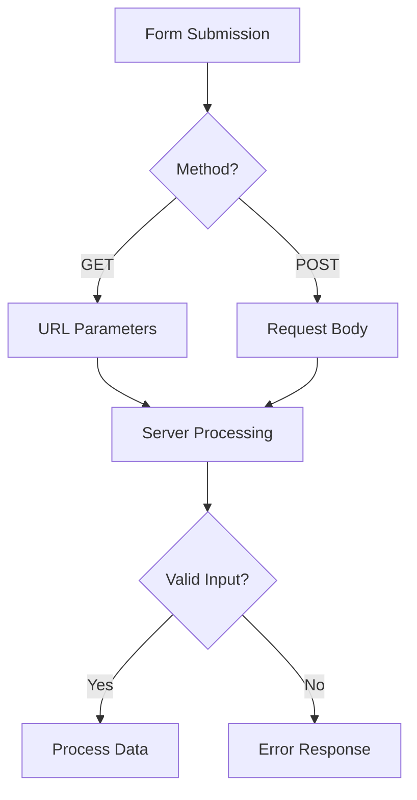

# PHP Data Handling

## Forms and Superglobals

### Definition
PHP superglobals are built-in variables that are always available in all scopes. Forms in PHP are used to collect user input data and process it using these superglobal variables.

### One-liners
- $_GET contains data sent through URL parameters
- $_POST contains data sent through HTTP POST method
- $_REQUEST contains data from both $_GET and $_POST
- $_FILES stores information about uploaded files
- $_SERVER provides server and execution environment information
- $GLOBALS contains references to all variables in global scope
- $_ENV stores environment variables
- Form data should always be validated and sanitized
- POST method is more secure than GET for sensitive data
- File uploads require proper configuration in php.ini

### Example

```php
<?php
// HTML Form
?>
<form method="post" action="process.php" enctype="multipart/form-data">
    <input type="text" name="username" required>
    <input type="password" name="password">
    <input type="file" name="userfile">
    <input type="submit" value="Submit">
</form>

<?php
// Processing Form Data
if ($_SERVER['REQUEST_METHOD'] === 'POST') {
    // Accessing POST data
    $username = $_POST['username'];
    $password = $_POST['password'];
    
    // File upload handling
    if (isset($_FILES['userfile'])) {
        $file = $_FILES['userfile'];
        $name = $file['name'];
        $type = $file['type'];
        $tmp_name = $file['tmp_name'];
        $error = $file['error'];
        $size = $file['size'];
    }
    
    // Server information
    $userAgent = $_SERVER['HTTP_USER_AGENT'];
    $ipAddress = $_SERVER['REMOTE_ADDR'];
}
?>
```

## Input/Output Controls and Validation

### Definition
Input/Output controls and validation are essential security measures to ensure data integrity and prevent malicious attacks in web applications.

### One-liners
- Always validate and sanitize user input
- Use filter_var() for input validation
- htmlspecialchars() prevents XSS attacks
- trim() removes whitespace from input
- strlen() checks input length
- is_numeric() verifies numeric input
- preg_match() performs pattern matching
- filter_input() validates input data
- Use prepared statements for SQL queries
- Implement CSRF protection for forms

### Example

```php
<?php
// Input Validation Functions
function validateEmail($email) {
    return filter_var($email, FILTER_VALIDATE_EMAIL);
}

function sanitizeInput($data) {
    $data = trim($data);
    $data = stripslashes($data);
    $data = htmlspecialchars($data);
    return $data;
}

// Form Validation Example
if ($_SERVER["REQUEST_METHOD"] == "POST") {
    $email = $_POST["email"];
    $age = $_POST["age"];
    
    $errors = [];
    
    if (!validateEmail($email)) {
        $errors[] = "Invalid email format";
    }
    
    if (!is_numeric($age) || $age < 0) {
        $errors[] = "Invalid age";
    }
    
    if (empty($errors)) {
        // Process valid data
        $email = sanitizeInput($email);
        // Continue with form processing
    }
}
?>
```

## Cookies and Sessions

### Definition
Cookies and Sessions are mechanisms for maintaining state and user data across multiple page requests in PHP applications.

### One-liners
- Cookies store data on client's browser
- Sessions store data on server
- $_COOKIE contains cookie data
- $_SESSION contains session variables
- session_start() initiates a session
- setcookie() creates a cookie
- session_destroy() ends a session
- Cookies can have expiration time
- Sessions timeout after configured period
- Sessions are more secure than cookies

### Example

```php
<?php
// Cookie Management
setcookie("user", "John Doe", time() + 3600, "/"); // Expires in 1 hour

// Reading Cookies
if (isset($_COOKIE["user"])) {
    echo "Welcome " . $_COOKIE["user"];
}

// Session Management
session_start();

// Setting Session Variables
$_SESSION["username"] = "john_doe";
$_SESSION["login_time"] = time();

// Accessing Session Data
if (isset($_SESSION["username"])) {
    echo "Logged in as: " . $_SESSION["username"];
}

// Destroying Session
session_destroy();
unset($_SESSION);
?>
```

### References
- PHP Manual: https://www.php.net/manual/en/language.variables.superglobals.php
- PHP Form Handling: https://www.w3schools.com/php/php_forms.asp
- PHP Sessions: https://www.php.net/manual/en/book.session.php
- PHP Security Guide: https://phptherightway.com/#security

### Fact
PHP sessions internally use a unique identifier called PHPSESSID that is automatically sent as a cookie to maintain session state. This ID is used to retrieve the correct session data from the server's storage.



