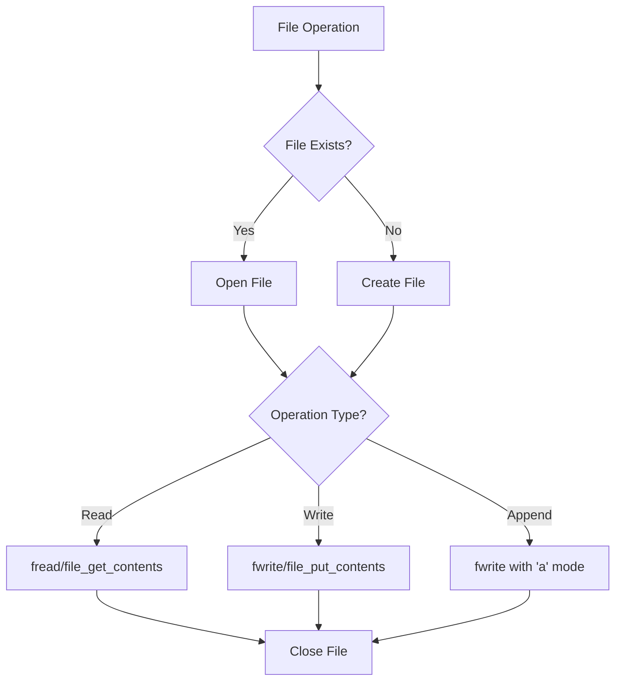
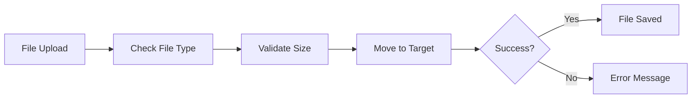

# PHP File Handling

## File Operations

### Definition
PHP File Handling involves operations for managing files and directories on the server, including creating, reading, writing, and manipulating files. PHP provides built-in functions to handle various file operations securely and efficiently.

### One-liners
- fopen() opens a file or URL
- fclose() closes an open file pointer
- fread() reads from file
- fwrite() writes to file
- file_get_contents() reads entire file into a string
- file_put_contents() writes data to a file
- unlink() deletes a file
- copy() copies a file
- rename() renames a file
- file_exists() checks if file exists
- filesize() gets file size
- is_file() checks if path is a file
- is_dir() checks if path is a directory
- mkdir() creates a directory
- rmdir() removes a directory
- scandir() lists files in directory
- basename() returns filename from path
- dirname() returns directory name from path
- pathinfo() returns information about file path

### Example

```php
<?php
// Opening and Reading a File
if (file_exists('example.txt')) {
    $handle = fopen('example.txt', 'r');
    if ($handle) {
        while (($line = fgets($handle)) !== false) {
            echo $line;
        }
        fclose($handle);
    }
}

// Writing to a File
$content = "Hello World\n";
$file = fopen('newfile.txt', 'w');
fwrite($file, $content);
fclose($file);

// Appending to a File
$file = fopen('newfile.txt', 'a');
fwrite($file, "New content\n");
fclose($file);

// Directory Operations
$dir = 'new_directory';
if (!is_dir($dir)) {
    mkdir($dir);
}

// List Files in Directory
$files = scandir('.');
foreach ($files as $file) {
    if ($file != '.' && $file != '..') {
        echo $file . "\n";
    }
}
?>
```

## File Upload and Download

### Definition
File upload and download functionality allows users to transfer files between their local system and the server. PHP provides secure methods to handle file uploads through HTML forms and manage downloads.

### One-liners
- $_FILES superglobal handles uploaded files
- move_uploaded_file() moves uploaded file to new location
- mime_content_type() gets MIME type of file
- readfile() outputs file content for download
- header() sets HTTP headers for download
- is_uploaded_file() verifies upload source
- filesize() checks upload size limits
- pathinfo() extracts file extension
- tempnam() creates temporary file
- file_get_contents() reads uploaded file

### Example

```php
<?php
// File Upload Form
?>
<form method="post" enctype="multipart/form-data">
    <input type="file" name="fileToUpload" id="fileToUpload">
    <input type="submit" value="Upload File" name="submit">
</form>

<?php
// Processing File Upload
if (isset($_POST["submit"])) {
    $target_dir = "uploads/";
    $target_file = $target_dir . basename($_FILES["fileToUpload"]["name"]);
    $uploadOk = 1;
    $imageFileType = strtolower(pathinfo($target_file,PATHINFO_EXTENSION));
    
    // Check file size
    if ($_FILES["fileToUpload"]["size"] > 500000) {
        echo "File is too large.";
        $uploadOk = 0;
    }
    
    if ($uploadOk == 1) {
        if (move_uploaded_file($_FILES["fileToUpload"]["tmp_name"], $target_file)) {
            echo "File uploaded successfully.";
        }
    }
}

// File Download
function downloadFile($file) {
    if (file_exists($file)) {
        header('Content-Description: File Transfer');
        header('Content-Type: application/octet-stream');
        header('Content-Disposition: attachment; filename="'.basename($file).'"');
        header('Expires: 0');
        header('Cache-Control: must-revalidate');
        header('Pragma: public');
        header('Content-Length: ' . filesize($file));
        readfile($file);
        exit;
    }
}
?>
```

### References
- PHP File System Functions: https://www.php.net/manual/en/ref.filesystem.php
- PHP File Upload: https://www.php.net/manual/en/features.file-upload.php
- PHP Directory Functions: https://www.php.net/manual/en/ref.dir.php
- PHP Security Best Practices: https://www.php.net/manual/en/security.filesystem.php

### Fact
PHP's file handling functions internally use streams, which provide a unified way of handling various types of files, URLs, and network connections. This abstraction allows PHP to handle not just local files but also remote files via HTTP, FTP, and other protocols using the same functions.



