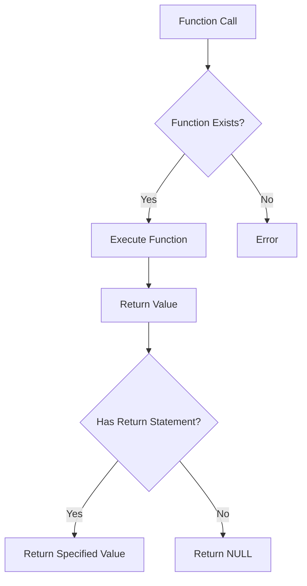
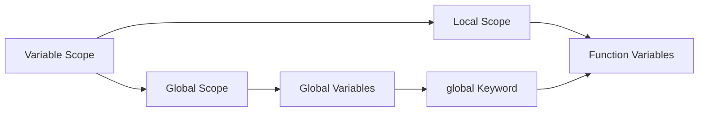

# PHP Functions & Strings

## Functions in PHP

### Definition
A function is a block of reusable code that performs a specific task. In PHP, functions are defined using the `function` keyword followed by the function name and parameters.

### One-liners
- Functions must be defined before they can be called
- Function names are case-insensitive in PHP
- Functions can accept parameters and return values
- Variables inside functions have local scope by default
- The `global` keyword allows access to global variables inside functions
- Functions can have default parameter values
- Type declarations can be used for parameters and return values
- Functions can return multiple values using arrays
- PHP supports anonymous functions (closures)
- Functions can be passed as arguments to other functions

### Example

```php
<?php
// Basic function definition
function greet($name) {
    return "Hello, $name!";
}

// Function with default parameter
function calculateArea($length, $width = 10) {
    return $length * $width;
}

// Function with type declarations
function add(int $a, int $b): int {
    return $a + $b;
}

// Function with variable scope
$message = "Global variable";
function testScope() {
    global $message;
    echo $message;
}

// Anonymous function
$multiply = function($x, $y) {
    return $x * $y;
};
?>
```

### System Defined Functions
1. String Functions
   - `strlen()` - Get string length
   - `str_replace()` - Replace text in a string
   - `substr()` - Extract part of a string
   - `strtolower()` - Convert string to lowercase
   - `strtoupper()` - Convert string to uppercase
   - `trim()` - Remove whitespace

2. Date & Time Functions
   - `date()` - Format a local date/time
   - `time()` - Return current Unix timestamp
   - `strtotime()` - Convert string to timestamp
   - `mktime()` - Create a timestamp

3. Hash Functions
   - `md5()` - Calculate MD5 hash
   - `sha1()` - Calculate SHA-1 hash
   - `password_hash()` - Create password hash
   - `password_verify()` - Verify password hash

4. Mail Function
   - `mail()` - Send email

### Example of Built-in Functions

```php
<?php
// String manipulation
$text = "  Hello World  ";
echo trim($text);                    // Remove whitespace
echo strlen($text);                  // String length
echo strtoupper($text);             // Convert to uppercase

// Date and time
echo date("Y-m-d H:i:s");          // Current date and time
echo time();                        // Unix timestamp
echo date("d/m/Y", strtotime("+1 week")); // Date after 1 week

// Hash example
$password = "mypassword123";
$hash = password_hash($password, PASSWORD_DEFAULT);
$verify = password_verify($password, $hash);

// Mail example
$to = "recipient@example.com";
$subject = "Test Email";
$message = "This is a test email.";
$headers = "From: sender@example.com";
mail($to, $subject, $message, $headers);
?>
```

## Strings in PHP

### Definition
A string is a sequence of characters that can be stored in a variable. PHP strings can be created using single quotes ('') or double quotes ("").

### One-liners
- Single quotes preserve the literal value of characters
- Double quotes parse variables and escape sequences
- Strings can be concatenated using the . operator
- String functions are case-sensitive
- PHP supports heredoc and nowdoc syntax for multiline strings
- String indices start at 0
- Negative string indices count from the end
- Strings can be accessed like arrays using square brackets
- PHP automatically converts numbers to strings when needed
- Special characters must be escaped using backslash

### Example

```php
<?php
// String creation
$single = 'Single quoted';
$double = "Double quoted";
$name = "PHP";
$combined = "Hello $name";     // Variable parsing
$concat = "Hello " . "World"; // Concatenation

// Heredoc syntax
$heredoc = <<<EOT
This is a heredoc string
It can span multiple lines
Variables like $name are parsed
EOT;

// Nowdoc syntax
$nowdoc = <<<'EOT'
This is a nowdoc string
Variables are not parsed here
$name remains as is
EOT;

// String access
$str = "Hello";
echo $str[0];    // Outputs "H"
echo $str[-1];   // Outputs "o"
?>
```

### References
- PHP Manual: https://www.php.net/manual/en/language.functions.php
- PHP String Functions: https://www.php.net/manual/en/ref.strings.php
- PHP Date Functions: https://www.php.net/manual/en/ref.datetime.php
- W3Schools PHP Functions: https://www.w3schools.com/php/php_functions.asp

### Fact
PHP functions can be dynamically called using variable function names (variable functions). For example: `$func = 'strlen'; $length = $func('test');` This powerful feature allows for dynamic function calls based on runtime conditions.



