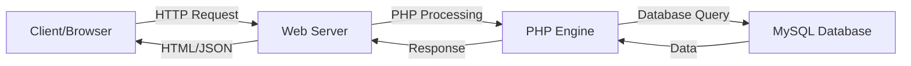

# PHP and MySQL Concepts

## Client & Server Environment

### Definition
A client-server environment is a distributed computing architecture where tasks and workloads are shared between service providers (servers) and service requesters (clients).

### Key Points
- Client (browser) sends requests to the server for resources or processing
- Server processes requests and returns responses to the client
- PHP runs on the server-side, processing requests and generating dynamic content
- Communication happens over HTTP/HTTPS protocols
- Servers can handle multiple client requests simultaneously

### Example


### References
- [PHP Manual - Client/Server Concepts](https://www.php.net/manual/en/intro-whatcando.php)
- [MDN Web Docs - Client-Server Overview](https://developer.mozilla.org/en-US/docs/Learn/Server-side/First_steps/Client-Server_overview)

### Fact
PHP was originally created by Rasmus Lerdorf in 1994 as a set of Common Gateway Interface (CGI) binaries written in C, and it stood for "Personal Home Page".

## PHP Features

### Definition
PHP is a server-side scripting language specifically designed for web development with numerous built-in features.

### Key Points
- Server-side execution
- Database integration capabilities
- Cross-platform compatibility
- Large standard library
- Support for multiple programming paradigms
- Built-in security features
- Session and cookie management
- File handling capabilities

### Example
```php
<?php
// Demonstrating various PHP features
session_start();                    // Session handling
$_SESSION['user'] = 'John';         // Session variable

$file = fopen('data.txt', 'r');     // File handling
$data = fread($file, filesize('data.txt'));
fclose($file);

$arr = array(1, 2, 3);             // Array manipulation
array_push($arr, 4);

$date = date('Y-m-d');             // Date handling
?>
```

### References
- [PHP Features Documentation](https://www.php.net/manual/en/features.php)

### Fact
PHP powers over 77% of all websites whose server-side programming language is known.

## Including PHP in Webpages

### Definition
PHP code can be embedded directly within HTML using special PHP tags.

### Key Points
- Use <?php ?> tags to embed PHP code
- .php file extension required
- Server processes PHP before sending to client
- Can mix HTML and PHP freely
- Short echo tag <?= ?> available

### Example
```php
<!DOCTYPE html>
<html>
<head>
    <title>PHP Integration</title>
</head>
<body>
    <h1><?php echo "Hello World"; ?></h1>
    
    <?php
    $color = "blue";
    ?>
    
    <p style="color: <?= $color; ?>">This text is <?= $color; ?></p>
    
    <?php if(date('H') < 12): ?>
        Good morning!
    <?php else: ?>
        Good afternoon!
    <?php endif; ?>
</body>
</html>
```

### References
- [PHP Tags Documentation](https://www.php.net/manual/en/language.basic-syntax.phptags.php)

### Fact
PHP files can contain HTML, CSS, JavaScript, text, and PHP code.

## Array Operators

### Definition
Array operators in PHP are used to compare arrays and perform operations on them.

### Key Points
- Union (+): Combines arrays, right operand values not overwriting left
- Equality (==): True if arrays have same key/value pairs
- Identity (===): True if arrays are identical in order and type
- Inequality (!=): True if arrays are not equal
- Non-identity (!==): True if arrays are not identical

### Example
```php
<?php
$arr1 = array("a" => 1, "b" => 2);
$arr2 = array("b" => 3, "c" => 4);

// Union
$result1 = $arr1 + $arr2; // array("a" => 1, "b" => 2, "c" => 4)

// Equality
$result2 = $arr1 == $arr2; // false

// Identity
$result3 = $arr1 === $arr2; // false

// Inequality
$result4 = $arr1 != $arr2; // true
?>
```

### References
- [PHP Array Operators](https://www.php.net/manual/en/language.operators.array.php)

### Fact
The union operator (+) in PHP arrays works differently from array_merge() - it only adds elements with keys that don't exist in the first array.

## Functions in PHP

### Definition
Functions are blocks of reusable code that perform specific tasks.

### Key Points
- Can accept parameters
- Can return values
- Support default parameter values
- Allow type declarations
- Can be anonymous (closures)
- Support variable scope
- Can be recursive

### Example
```php
<?php
// Function with type declarations and default value
function calculateTotal(float $price, float $tax = 0.1): float {
    return $price * (1 + $tax);
}

// Anonymous function
$greet = function($name) {
    return "Hello, $name!";
};

// Arrow function (PHP 7.4+)
$square = fn($x) => $x * $x;

// Using the functions
echo calculateTotal(100);     // Output: 110
echo $greet("John");         // Output: Hello, John!
echo $square(5);             // Output: 25
?>
```

### References
- [PHP Functions Manual](https://www.php.net/manual/en/language.functions.php)

### Fact
PHP supports first-class functions, meaning functions can be assigned to variables, passed as arguments, and returned from other functions.

## $GLOBALS in PHP

### Definition
$GLOBALS is a superglobal array that contains references to all variables which are currently defined in the global scope of the script.

### Key Points
- Accessible from any scope
- Contains all global variables
- Array keys are variable names
- Can modify global variables
- Available in all PHP versions

### Example
```php
<?php
$x = 10;
$y = 20;

function addNumbers() {
    $GLOBALS['z'] = $GLOBALS['x'] + $GLOBALS['y'];
    return $GLOBALS['z'];
}

echo addNumbers();  // Output: 30
echo $z;           // Output: 30 (accessible outside function)

// Another example with form data
$GLOBALS['user_input'] = $_POST['username'];

function validateInput() {
    if(empty($GLOBALS['user_input'])) {
        return "Username is required";
    }
    return "Valid input";
}
?>
```

### References
- [PHP Superglobals - $GLOBALS](https://www.php.net/manual/en/reserved.variables.globals.php)

### Fact
While $GLOBALS provides global access to variables, it's generally considered better practice to use parameter passing and return values for better code maintainability.

## Looping Statements

### Definition
Looping statements in PHP are used to execute a block of code repeatedly based on a condition.

### Key Points
1. For Loop:
   - Used when number of iterations is known
   - Has initialization, condition, and increment/decrement
   - Can have multiple expressions

2. While Loop:
   - Executes while condition is true
   - Condition checked before execution
   - Can lead to infinite loops if not careful

### Example
```php
<?php
// For Loop Example
echo "For Loop:\n";
for($i = 1; $i <= 5; $i++) {
    echo "Iteration $i\n";
}

// While Loop Example
echo "\nWhile Loop:\n";
$counter = 1;
while($counter <= 5) {
    echo "Count: $counter\n";
    $counter++;
}

// Practical Example: Processing an Array
$fruits = array("Apple", "Banana", "Orange");

for($i = 0; $i < count($fruits); $i++) {
    echo "Fruit $i: $fruits[$i]\n";
}
?>
```

### References
- [PHP Control Structures](https://www.php.net/manual/en/language.control-structures.php)

### Fact
PHP's foreach loop is specifically optimized for iterating over arrays and objects, making it more efficient than using a for loop with array indices.

## MySQL Concepts

### Definition
MySQL is an open-source relational database management system that uses SQL.

### Key Points
- Open-source RDBMS
- ACID compliant
- Multi-user, multi-threaded
- Cross-platform support
- High performance
- Robust security features

### Advantages
1. Easy to use and learn
2. High performance and reliability
3. Cross-platform compatibility
4. Strong security features
5. Large community support
6. Free and open-source
7. Scalability options

### Example
```sql
-- Creating Employee Table
CREATE TABLE employees (
    id INT PRIMARY KEY AUTO_INCREMENT,
    name VARCHAR(50) NOT NULL,
    position VARCHAR(50),
    salary DECIMAL(10,2),
    hire_date DATE
);

-- Inserting Data
INSERT INTO employees (name, position, salary, hire_date)
VALUES 
    ('John Doe', 'Developer', 75000.00, '2023-01-15'),
    ('Jane Smith', 'Manager', 85000.00, '2022-11-01');

-- Extracting Specific Columns
SELECT name, position, salary 
FROM employees 
WHERE salary > 70000;
```

### References
- [MySQL Documentation](https://dev.mysql.com/doc/)
- [W3Schools MySQL Tutorial](https://www.w3schools.com/mysql/)

### Fact
MySQL was originally developed by a Swedish company MySQL AB, founded by David Axmark, Allan Larsson, and Michael "Monty" Widenius.

## Date and Time Functions

### Definition
PHP provides various built-in functions to work with dates and times.

### Key Points
Top 5 Date/Time Functions:
1. date() - Formats a timestamp
2. strtotime() - Converts string to timestamp
3. time() - Returns current Unix timestamp
4. mktime() - Creates a timestamp
5. date_diff() - Calculates difference between dates

### Example
```php
<?php
// 1. date()
$current_date = date("Y-m-d H:i:s");  // Current date and time
echo $current_date;

// 2. strtotime()
$future_date = strtotime("+1 week");
echo date("Y-m-d", $future_date);

// 3. time()
$timestamp = time();
echo $timestamp;

// 4. mktime()
$specific_date = mktime(15, 30, 0, 12, 25, 2023);  // 3:30 PM, Dec 25, 2023
echo date("Y-m-d H:i:s", $specific_date);

// 5. date_diff()
$date1 = date_create("2023-01-01");
$date2 = date_create("2023-12-31");
$diff = date_diff($date1, $date2);
echo $diff->format("%R%a days");
?>
```

### References
- [PHP Date/Time Functions](https://www.php.net/manual/en/ref.datetime.php)

### Fact
PHP's internal date handling uses Unix timestamps, which count seconds since January 1, 1970 00:00:00 GMT (the "Unix Epoch").