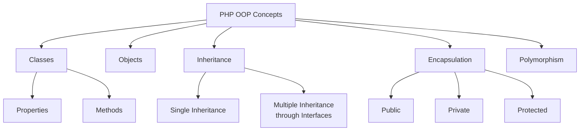

# Object-Oriented Programming with PHP

## Introduction to OOP in PHP

### Definition
Object-Oriented Programming in PHP is a programming paradigm that uses objects and classes to structure and organize code in a reusable and maintainable way.

### One-liners
- PHP supports all major OOP concepts including classes, objects, inheritance, encapsulation, and polymorphism
- Classes serve as blueprints for creating objects with shared properties and methods
- Objects are instances of classes that contain both data and code
- Encapsulation helps hide internal details and protect data integrity
- Inheritance allows creating new classes based on existing ones
- Polymorphism enables using objects of different classes through the same interface

### Example
```php
// Define a class
class Student {
    // Properties
    private $name;
    private $id;
    
    // Constructor
    public function __construct($name, $id) {
        $this->name = $name;
        $this->id = $id;
    }
    
    // Method
    public function getInfo() {
        return "Student: {$this->name}, ID: {$this->id}";
    }
}

// Create an object
$student = new Student("John Doe", "12345");
echo $student->getInfo();
```

## PHP Language Basics

### Definition
PHP (Hypertext Preprocessor) is a server-side scripting language designed specifically for web development.

### One-liners
- PHP code is executed on the server and generates HTML sent to the client
- PHP files have the extension ".php"
- PHP code must be enclosed within <?php ?> tags
- Statements must end with a semicolon
- Variables start with the $ symbol
- PHP is loosely typed language
- Comments can be single-line (//) or multi-line (/* */)

### Example
```php
<?php
// Single line comment
/* Multi-line
   comment */

// Variable declaration
$greeting = "Hello World";
echo $greeting;

// Constants
define("MAX_VALUE", 100);
const MIN_VALUE = 0;

// Data types
$string = "text";
$integer = 42;
$float = 3.14;
$boolean = true;
$array = [1, 2, 3];
$null = null;
?>
```

## Flow Control and Loops

### Definition
Control structures and loops in PHP allow you to control the flow of program execution based on conditions and repeat code blocks.

### One-liners
- if-else statements make decisions based on conditions
- switch statements handle multiple conditions
- while loops execute while a condition is true
- for loops iterate a specific number of times
- foreach loops iterate over arrays and objects
- break statement exits a loop
- continue statement skips to next iteration

### Example
```php
<?php
// If-else statement
$age = 18;
if ($age >= 18) {
    echo "Adult";
} else {
    echo "Minor";
}

// Loop example
$colors = ["red", "green", "blue"];
foreach ($colors as $color) {
    echo $color . "<br>";
}
?>
```

## Arrays in PHP

### Definition
Arrays in PHP are ordered maps that can hold multiple values of any type.

### One-liners
- PHP supports both indexed and associative arrays
- Arrays can hold mixed data types
- Array elements can be accessed using index or key
- Array functions like sort(), count(), array_push() are available
- Multidimensional arrays are supported
- Arrays can be merged using array_merge()
- Array elements can be filtered using array_filter()

### Example
```php
<?php
// Indexed array
$fruits = ["apple", "banana", "orange"];

// Associative array
$person = [
    "name" => "John",
    "age" => 30,
    "city" => "New York"
];

// Multidimensional array
$matrix = [
    [1, 2, 3],
    [4, 5, 6],
    [7, 8, 9]
];
?>
```

## PHP in Web Development

### Definition
PHP can be embedded directly into HTML, making it powerful for creating dynamic web pages.

### One-liners
- PHP code can be mixed with HTML using <?php ?> tags
- Echo and print statements output content
- PHP can process form data
- PHP can handle file uploads
- PHP can manage sessions and cookies
- PHP can connect to databases
- PHP supports error handling and debugging

### Example
```php
<!DOCTYPE html>
<html>
<head>
    <title>PHP in HTML</title>
</head>
<body>
    <h1><?php echo "Welcome to PHP"; ?></h1>
    
    <?php
    $users = ["John", "Jane", "Bob"];
    ?>
    
    <ul>
    <?php foreach($users as $user): ?>
        <li><?php echo $user; ?></li>
    <?php endforeach; ?>
    </ul>
</body>
</html>
```

### References
- [PHP Documentation](https://www.php.net/manual/en/language.oop5.php)
- [W3Schools PHP OOP](https://www.w3schools.com/php/php_oop_what_is.asp)
- [PHP.net](https://www.php.net)
- [YouTube: PHP OOP Tutorials](https://www.youtube.com/results?search_query=php+oop+tutorial)

### Fact
PHP was originally created by Rasmus Lerdorf in 1994 and stood for "Personal Home Page". It was later renamed to "PHP: Hypertext Preprocessor", making it a recursive acronym.

