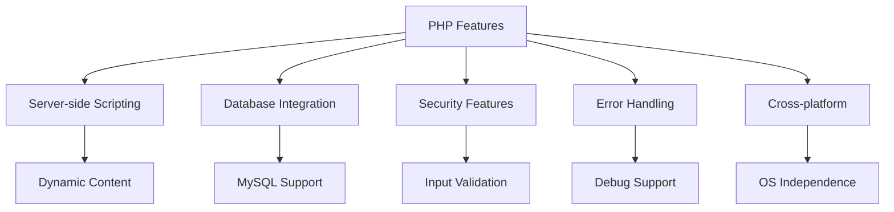
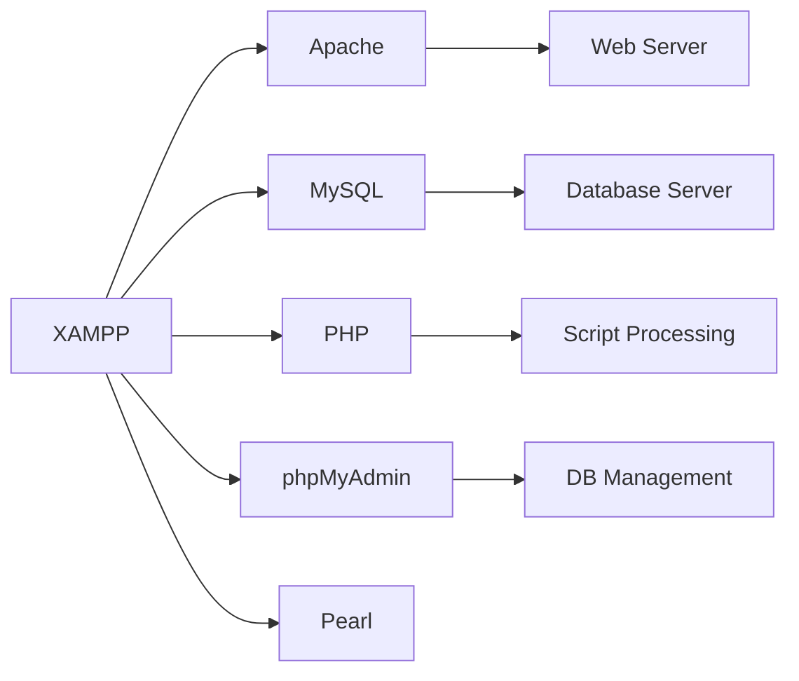
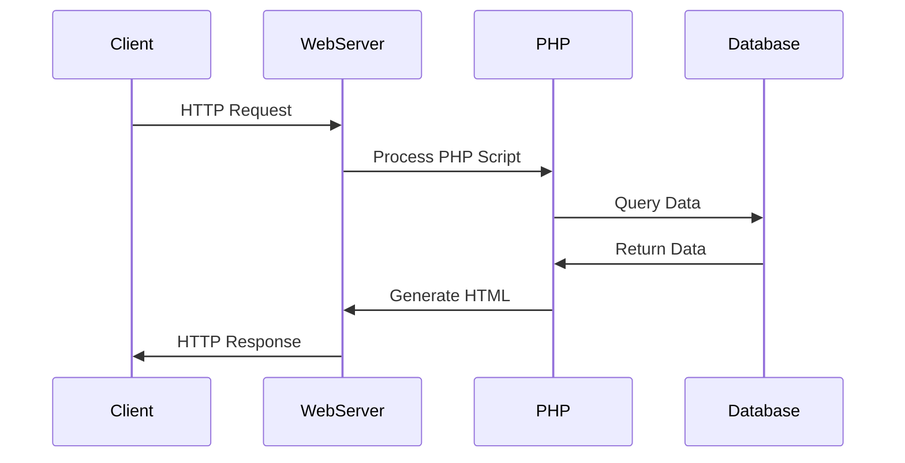
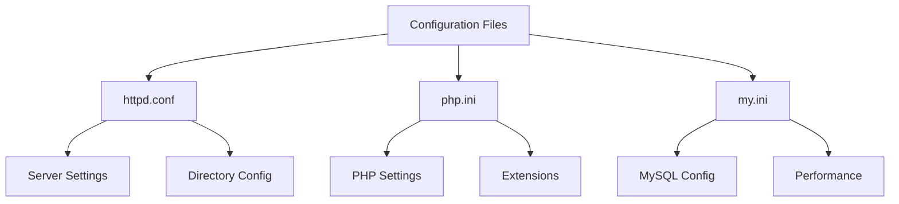

# UNIT-I: BASICS OF PHP

## Introduction to PHP
PHP (Hypertext Preprocessor) is a server-side scripting language designed specifically for web development.

### Key Points
- Created by Rasmus Lerdorf in 1994
- Open-source language
- Embedded directly in HTML
- Executed on the server-side

## PHP Features

### Core Features
- Server-side scripting
- Command-line scripting
- Cross-platform compatibility
- Database support
- Error handling
- Security features

## XAMPP/WAMP Installation

### XAMPP Components
- Apache (Web Server)
- MySQL (Database)
- PHP (Scripting Language)
- phpMyAdmin (Database Management)
- Pearl

## Benefits of PHP-MySQL

### Advantages
1. Cost-effective (Open Source)
2. Large Community Support
3. Cross-platform Compatibility
4. Easy Integration
5. Robust Security Features

## Server-Client Environment

### Components
1. **Client Side**
   - Web Browser
   - HTML/CSS/JavaScript
   - User Interface

2. **Server Side**
   - Web Server (Apache)
   - PHP Interpreter
   - Database Server

## Web Server Installation & Configuration

### Apache Configuration Files
- **httpd.conf**: Main configuration file
- **php.ini**: PHP configuration
- **my.ini**: MySQL configuration

## Exam Focus Points

### Key Concepts to Remember
1. **PHP Basics**
   - Syntax and structure
   - Variables and data types
   - Control structures

2. **Server Architecture**
   - Request processing flow
   - Role of each component
   - Configuration importance

3. **Database Integration**
   - Connection methods
   - Basic operations
   - Security practices

### Practice Questions
1. What is PHP and why is it used in web development?
2. Explain the components of XAMPP/WAMP.
3. Describe the client-server architecture in web applications.
4. List the main configuration files and their purposes.
5. What are the benefits of using PHP with MySQL?